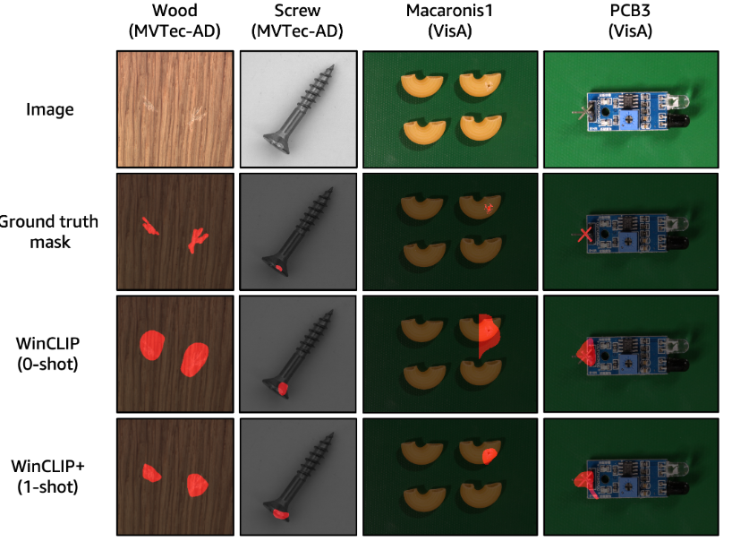

# WinCLIP: Zero-/Few-Shot Anomaly Classification and Segmentation
<p align="center"></p>
Unofficial implementation of:

WinCLIP: Zero-/Few-Shot Anomaly Classification and Segmentation, CVPR 2023 [[Paper]](https://openaccess.thecvf.com/content/CVPR2023/html/Jeong_WinCLIP_Zero-Few-Shot_Anomaly_Classification_and_Segmentation_CVPR_2023_paper.html)


#### Install python dependencies
```
sh install.sh
```


#### Download MVTec-AD dataset
* Follow instructions in https://www.mvtec.com/company/research/datasets/mvtec-ad/

#### Download Visa dataset
* Follow instructions in https://paperswithcode.com/dataset/visa

## Run run_winclip.py to reproduce the implementation results
```
python run_winclip.py
```
